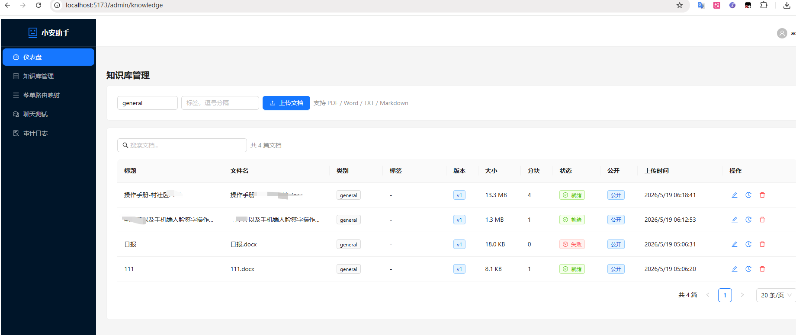
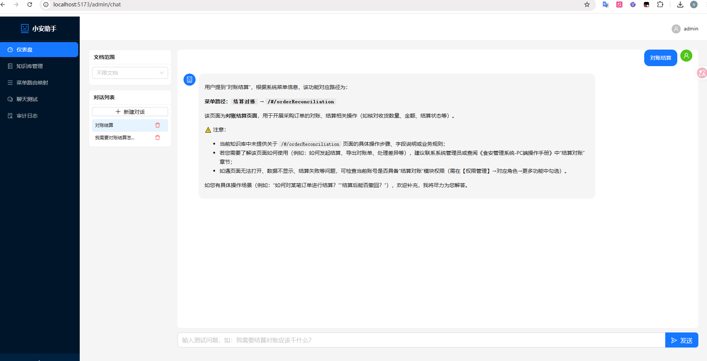
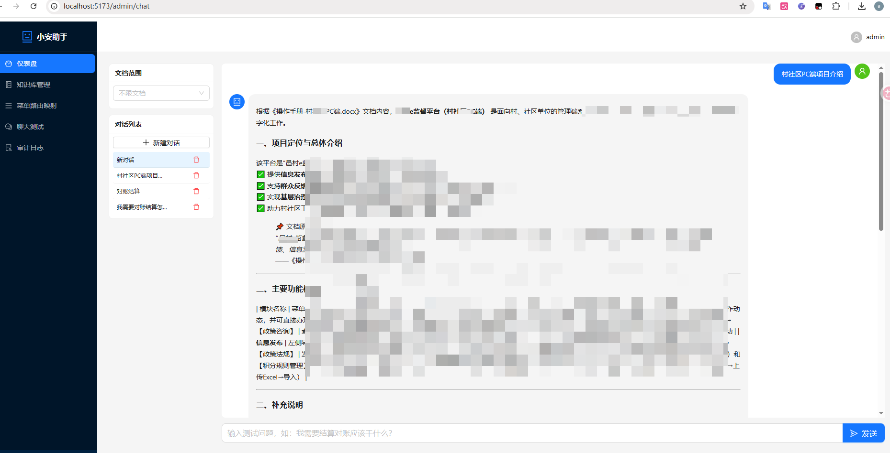
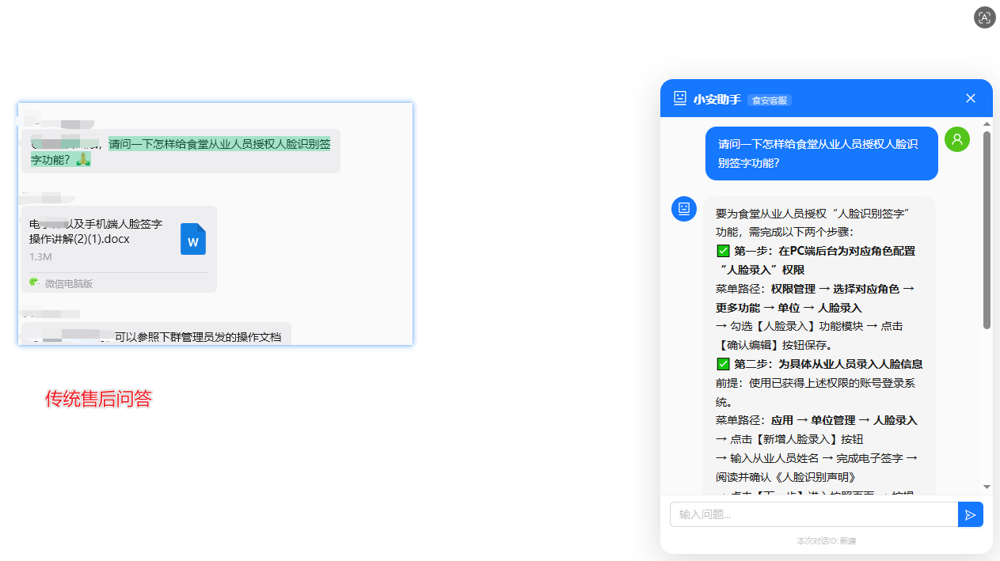

# 小安助手 (XiaoAn Assistant)

> 企业级智能客服助手系统 — 基于 RAG 的问答引擎 + 系统菜单导航 + 可嵌入聊天组件

小安助手是一款面向企业业务系统的智能助手，通过 **RAG（检索增强生成）** 技术，让用户能够以自然语言问答的方式快速找到系统功能入口、了解业务操作流程、查询食品安全法规等知识，并提供可嵌入第三方系统的聊天组件。

---

## 界面展示

| 截图 | 说明 |
|:---:|:---:|
|  | 管理后台 — 知识库管理、菜单配置、审计日志 |
|  | 内置聊天测试页面，用于调试 RAG 问答效果 |
|  | 聊天回答展示：文本回复 + 来源标签 + 菜单卡片 |
|  | Widget 嵌入宿主系统的实际效果 |
|  | RAG 与非 RAG 的问答效果对比 |

---

## 功能特性

### 📚 知识库管理
- 支持 PDF、Word、TXT、Markdown 文档上传
- 自动文档分块（Chunking）与向量化存入 ChromaDB
- 混合搜索（向量相似度 + BM25 关键词）提升检索精度
- 文档版本管理，支持回滚与历史查询
- 分类、标签、公开/私有权限控制

### 🧠 智能问答（RAG）
- 基于 LangChain + ChromaDB 的检索增强生成
- 流式响应（SSE），实时展示回答内容
- 自动识别用户意图，关联知识文档与系统菜单
- 提供操作步骤引导（Step-by-Step Guide）
- 多轮对话上下文记忆

### 📋 系统菜单路由映射
- 管理企业系统的菜单结构与路由地址
- 树形/列表两种视图
- 关键词搜索菜单，快速定位功能入口
- 面包屑路径自动生成
- 支持批量导入

### 🧩 嵌入式聊天组件（Widget）
- 通过 `<iframe>` 嵌入第三方业务系统
- 基于 `postMessage` 与宿主系统通信，实现菜单跳转
- 轻量化 UI，支持展开/折叠
- 独立认证机制（API Token）

### 🔐 安全与审计
- JWT 用户认证（支持注册/登录）
- 完整的审计日志记录（操作事件、资源变更、用户行为）
- 角色权限管理（admin / editor / viewer）

### 🤖 多 LLM 提供商支持
- OpenAI（GPT-4o / GPT-4 / GPT-3.5）
- 通义千问（Qwen）
- DeepSeek
- 智谱 GLM

---

## 技术栈

| 层级 | 技术 |
|------|------|
| **后端框架** | Python FastAPI |
| **ORM** | SQLAlchemy 2.0 (Async) + SQLite |
| **向量数据库** | ChromaDB |
| **LLM 框架** | LangChain |
| **前端框架** | React 18 + TypeScript |
| **UI 组件库** | Ant Design 5 |
| **构建工具** | Vite 6 |
| **认证** | JWT (python-jose) + bcrypt |

---

## 快速开始

### 环境要求

- Python 3.10+
- Node.js 18+
- LLM API Key（以 OpenAI 为例）

### 后端启动

```bash
# 1. 进入后端目录
cd backend

# 2. 创建虚拟环境
python -m venv venv
source venv/bin/activate  # Windows: venv\Scripts\activate

# 3. 安装依赖
pip install -r requirements.txt

# 4. 配置环境变量
cp .env.example .env
# 编辑 .env，填入你的 API Key 等配置

# 5. 启动服务（自动初始化数据库 + 种子数据）
python run.py
```

服务默认启动在 `http://localhost:8000`，API 文档访问 `http://localhost:8000/docs`。

### 前端启动

```bash
# 1. 进入前端目录
cd frontend

# 2. 安装依赖
npm install

# 3. 启动开发服务器
npm run dev
```

前端默认启动在 `http://localhost:5173`，已配置代理转发 `/api` 到后端。

### 嵌入式组件构建

```bash
npm run build:widget
```

构建产物在 `dist/widget.html`，可通过 iframe 嵌入使用。

---

## 环境变量说明

| 变量 | 说明 | 默认值 |
|------|------|--------|
| `LLM_PROVIDER` | LLM 提供商 (openai/tongyi/deepseek/zhipu) | `openai` |
| `OPENAI_API_KEY` | OpenAI API 密钥 | - |
| `OPENAI_MODEL` | OpenAI 模型名 | `gpt-4o` |
| `DASHSCOPE_API_KEY` | 通义千问 API 密钥 | - |
| `DEEPSEEK_API_KEY` | DeepSeek API 密钥 | - |
| `DATABASE_URL` | 数据库连接 URL | `sqlite+aiosqlite:///./storage/xiaoan.db` |
| `CHROMA_PATH` | ChromaDB 存储路径 | `./storage/chroma` |
| `JWT_SECRET` | JWT 签名密钥 | `change-me-in-production` |
| `WIDGET_API_KEY` | Widget API 认证密钥 | `xiaoan-widget-key-change-in-production` |

完整配置请参考 `backend/.env.example`。

---

## 项目结构

```
xiaoan-assistant/
├── backend/                    # 后端 (Python FastAPI)
│   ├── app/
│   │   ├── api/                # API 路由层
│   │   │   ├── auth.py         # 认证接口
│   │   │   ├── knowledge.py    # 知识库接口
│   │   │   ├── menu.py         # 菜单管理接口
│   │   │   ├── chat.py         # 聊天对话接口
│   │   │   └── audit.py        # 审计日志接口
│   │   ├── core/
│   │   │   ├── security.py     # JWT / 密码 / 认证中间件
│   │   │   └── llm_factory.py  # LLM 工厂（多提供商支持）
│   │   ├── models/             # SQLAlchemy 数据模型
│   │   │   ├── user.py         # 用户模型
│   │   │   ├── knowledge.py    # 知识文档/分块/版本模型
│   │   │   ├── menu.py         # 系统菜单模型
│   │   │   ├── conversation.py # 对话/消息模型
│   │   │   └── audit.py        # 审计日志模型
│   │   ├── schemas/            # Pydantic 请求/响应模型
│   │   ├── services/           # 业务逻辑层
│   │   ├── config.py           # 配置管理
│   │   └── database.py         # 数据库连接
│   ├── .env.example            # 环境变量模板
│   ├── requirements.txt        # Python 依赖
│   ├── run.py                  # 启动脚本
│   ├── seed_data.py            # 种子数据（菜单 + 示例知识）
│   └── seed_knowledge.py       # 知识库初始化
├── frontend/                   # 前端 (React + TypeScript)
│   ├── src/
│   │   ├── api/
│   │   │   └── client.ts       # API 客户端封装
│   │   ├── components/         # 公共组件
│   │   │   ├── Layout.tsx      # 后台管理布局
│   │   │   ├── ChatBubble.tsx  # 聊天气泡
│   │   │   ├── StreamingText.tsx # 流式文本
│   │   │   ├── MenuCard.tsx    # 菜单卡片
│   │   │   └── StepGuide.tsx   # 步骤引导
│   │   ├── pages/
│   │   │   ├── Login.tsx       # 登录页
│   │   │   ├── admin/          # 后台管理页面
│   │   │   │   ├── Dashboard.tsx     # 仪表盘
│   │   │   │   ├── KnowledgeBase.tsx # 知识库管理
│   │   │   │   ├── MenuMapping.tsx   # 菜单映射管理
│   │   │   │   ├── ChatTest.tsx      # 聊天测试
│   │   │   │   └── AuditLog.tsx      # 审计日志
│   │   │   └── widget/
│   │   │       └── ChatWidget.tsx    # 嵌入式聊天组件
│   │   ├── types/index.ts      # TypeScript 类型定义
│   │   ├── App.tsx              # 路由配置
│   │   └── main.tsx            # 入口文件
│   ├── index.html              # 管理后台入口
│   ├── widget.html             # 嵌入式组件入口
│   ├── vite.config.ts          # Vite 配置
│   └── package.json            # 前端依赖
└── README.md
```

---

## API 概览

| 方法 | 路径 | 说明 |
|------|------|------|
| POST | `/api/v1/auth/register` | 用户注册 |
| POST | `/api/v1/auth/login` | 用户登录 |
| POST | `/api/v1/chat/{conv_id}` | 发送聊天消息（SSE 流式返回） |
| POST | `/api/v1/chat/widget` | Widget 聊天消息 |
| GET  | `/api/v1/chat/conversations` | 获取对话列表 |
| POST | `/api/v1/chat/conversations` | 创建新对话 |
| GET  | `/api/v1/knowledge` | 获取知识文档列表 |
| POST | `/api/v1/knowledge/upload` | 上传知识文档 |
| PUT  | `/api/v1/knowledge/{id}` | 更新知识文档 |
| DELETE | `/api/v1/knowledge/{id}` | 删除知识文档 |
| GET  | `/api/v1/knowledge/{id}/versions` | 获取文档版本历史 |
| GET  | `/api/v1/menus` | 获取菜单列表 |
| GET  | `/api/v1/menus/tree` | 获取菜单树 |
| POST | `/api/v1/menus` | 创建菜单 |
| PUT  | `/api/v1/menus/{id}` | 更新菜单 |
| DELETE | `/api/v1/menus/{id}` | 删除菜单 |
| GET  | `/api/v1/menus/search` | 搜索菜单 |
| GET  | `/api/v1/audit` | 获取审计日志 |

---

## 默认账号

启动种子数据后自动创建：

| 用户名 | 密码 | 角色 |
|--------|------|------|
| `admin` | `admin123` | admin |

---

## 许可

MIT License
